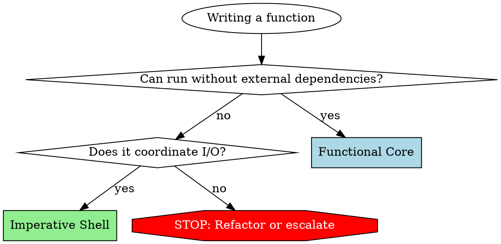

# Functional Core, Imperative Shell (FCIS)

## Overview

**Core principle:** Separate pure business logic (Functional Core) from side effects (Imperative Shell). Pure functions go in one file, I/O operations in another.

**Why this matters:** Pure functions are trivial to test (no mocks needed). I/O code is isolated to thin shells. Bugs become structurally impossible when business logic has no side effects.

## When to Use

**Use FCIS when:**
- Writing any new code file
- Refactoring existing code
- Reviewing code for architectural decisions
- Deciding where logic belongs

**Trigger symptoms:**
- "Where should this function go?"
- Creating a new file
- Adding database calls to logic
- Adding file I/O to calculations
- Writing tests that need complex mocking

## MANDATORY: File Classification

**YOU MUST add pattern comment to EVERY file you create or modify:**

```
// pattern: Functional Core
// pattern: Imperative Shell
// pattern: Mixed (needs refactoring)
```

**If file genuinely cannot be separated (rare), document why:**

```
// pattern: Mixed (unavoidable)
// Reason: [specific technical justification]
// Example: Performance-critical path where separating I/O causes unacceptable overhead
```

**No file without classification.** If you create code without this comment, you have violated the requirement.

### Exceptions: Files That Don't Need Classification

**DO NOT add pattern comments to:**
- Bash/shell scripts (.sh, .bash) - inherently imperative
- Configuration files (eslint.config.js, tsconfig.json, .env, etc.)
- Markdown documentation (.md)
- HTML files (.html)
- Task runner files (justfile, Makefile, etc.)
- Package manifests (package.json, pyproject.toml, etc.)
- Data files (JSON, YAML, CSV, etc.)

**Classification applies ONLY to application code** (source files containing business logic or I/O orchestration).

## File Type Definitions

### Functional Core Files

**Contains ONLY:**
- Pure functions (same input -> same output, always)
- Business logic, validations, calculations, transformations
- Data structure operations
- Logging (EXCEPTION: loggers are permitted in Functional Core)

**NEVER contains:**
- File I/O (reading, writing files)
- Database operations (queries, updates, connections)
- HTTP requests or responses
- Environment variable access
- Date.now(), Math.random(), or other non-deterministic functions
- State mutations outside function scope

**Logging exception:** Functions MAY accept and use loggers. For unit tests, pass no-op loggers. This is the ONLY permitted side effect in Functional Core.

**Test signature:** Simple assertions, no mocks except logger (if used).

### Imperative Shell Files

**Contains ONLY:**
- I/O operations: file system, database, HTTP, environment
- Orchestration: gather data -> call Functional Core -> persist results
- Error handling for I/O failures
- Minimal business logic (coordination only)

**NEVER contains:**
- Complex calculations
- Business rule validations
- Data transformations beyond format conversion

**Test signature:** Integration tests with real dependencies or test doubles.

## Code Flow Pattern

```
1. GATHER (Shell):  Collect data from external sources
2. PROCESS (Core):  Transform input to output (pure)
3. PERSIST (Shell): Save results externally
```

**Every operation follows this sequence.** No exceptions.

## Decision Framework

Before writing a function, ask:



**Questions to ask:**
- Can this logic run without file system, database, network, or environment?
  - **YES** -> Functional Core
  - **NO** -> Does it coordinate I/O or contain business logic?
    - **I/O coordination** -> Imperative Shell
    - **Business logic + I/O** -> STOP. Refactor or escalate to user.

## Common Mistakes and Rationalizations

| Excuse/Thought Pattern | Reality | What To Do |
|------------------------|---------|------------|
| "Just one file read in this calculation" | File I/O = side effect. Not Functional Core. | Extract to Shell. Pass data as parameter. |
| "Database is passed as parameter, so it's pure" | Database operations are I/O. Not pure. | Move to Shell. Core receives data, not DB connection. |
| "This validation needs to check if file exists" | File system check = I/O. Not Functional Core. | Shell checks file, passes boolean to Core validation. |
| "Small HTTP call, won't hurt" | HTTP = side effect. Breaks purity guarantee. | Shell makes request, Core processes response data. |
| "Need Date.now() for timestamp calculation" | Non-deterministic. Not pure. | Shell passes timestamp as parameter. |
| "Logging is a side effect, should remove" | **WRONG.** Logging is explicitly permitted. | Keep logger. This is the exception. |
| "This function does both logic and I/O, but it's simpler" | Mixed concerns = untestable without mocks. | Split into Core (logic) + Shell (I/O). Test Core simply. |
| "File classification is overhead" | Prevents entire classes of bugs. Non-negotiable. | Add classification comment. Takes 10 seconds. |
| "I'll refactor later" | Later never comes. Do it now. | Classify and separate now. |
| "Performance requires mixing" | Prove it with benchmarks. Usually wrong. | Separate first. Optimize with evidence. Mark Mixed (unavoidable) with justification. |

## Red Flags - STOP and Refactor

If you catch yourself doing ANY of these, STOP:

- **File I/O in a "pure" function** (open, read, write, exists checks)
- **Database passed as parameter to Functional Core** (queries, updates, connections)
- **HTTP requests in business logic** (fetch, axios, requests)
- **Environment variables in calculations** (process.env, os.getenv)
- **Math.random() or Date.now() in Functional Core** (non-deterministic)
- **Creating a file without pattern classification comment**
- **Thinking "just this once" about mixing concerns**

**All of these mean:** Extract I/O to Shell. Pass data to Core. Classify file correctly.

## Implementation Patterns

### Functional Core Pattern

```python
# pattern: Functional Core

def calculate_total_with_tax(items, tax_rate, logger=None):
    """Pure calculation: same inputs always produce same output."""
    if logger:
        logger.debug(f"Calculating total for {len(items)} items")

    subtotal = sum(item['price'] * item['quantity'] for item in items)
    tax = subtotal * tax_rate
    total = subtotal + tax

    return {
        'subtotal': subtotal,
        'tax': tax,
        'total': total
    }
```

**No I/O. No database. No file system. Only computation.**

### Imperative Shell Pattern

```python
# pattern: Imperative Shell

def process_order(order_id, db, logger):
    """Orchestrates: gather -> process -> persist."""

    # GATHER: Collect data from external sources
    items = db.get_order_items(order_id)
    tax_rate = db.get_tax_rate_for_order(order_id)

    # PROCESS: Call Functional Core (pure logic)
    result = calculate_total_with_tax(items, tax_rate, logger)

    # PERSIST: Save results externally
    db.update_order_total(order_id, result['total'])

    return result
```

**Shell is thin. Core does heavy lifting. Testable separately.**

### Mixed (Needs Refactoring) - Bad Example

```python
# pattern: Mixed (needs refactoring)

def calculate_and_save_total(order_id, db):
    """BAD: Mixes calculation with I/O. Hard to test."""
    items = db.get_order_items(order_id)  # I/O
    subtotal = sum(item['price'] for item in items)  # Logic
    tax_rate = db.get_tax_rate_for_order(order_id)  # I/O
    tax = subtotal * tax_rate  # Logic
    total = subtotal + tax  # Logic
    db.update_order_total(order_id, total)  # I/O
    return total
```

**Testing this requires database mocks. Fragile. Refactor using patterns above.**

## Logger Exception Details

**Loggers are EXPLICITLY PERMITTED in Functional Core.**

```python
# pattern: Functional Core

def validate_order(order_data, logger=None):
    """Pure validation with logging."""
    if logger:
        logger.info(f"Validating order {order_data.get('id')}")

    errors = []

    if not order_data.get('items'):
        errors.append("Order must have items")

    if order_data.get('total', 0) < 0:
        errors.append("Total cannot be negative")

    if logger and errors:
        logger.warning(f"Validation failed: {errors}")

    return {'valid': len(errors) == 0, 'errors': errors}
```

**For unit tests:** Pass no-op logger or None. Function remains pure for testing.

## Refactoring Patterns

Common patterns for separating concerns:

### Extract Pure Core from Impure Functions

**Symptom:** Function mixes I/O with logic

```python
# BEFORE - hard to test
def process_order(order_id: str) -> None:
    order = db.fetch(order_id)           # I/O
    discount = calculate_discount(order)  # Pure logic
    total = apply_discount(order, discount)  # Pure logic
    db.save(order_id, total)             # I/O

# AFTER - pure core extracted
def calculate_order_total(order: Order, rules: DiscountRules) -> Decimal:
    """Pure function - easy to test."""
    discount = calculate_discount(order, rules)
    return apply_discount(order, discount)

def process_order(order_id: str) -> None:
    """Thin I/O wrapper."""
    order = db.fetch(order_id)
    total = calculate_order_total(order, get_discount_rules())
    db.save(order_id, total)
```

### Return Values Instead of Mutating

**Symptom:** Methods mutate in place, making before/after comparison hard

```python
# BEFORE - mutation
def sort_tasks(tasks: list[Task]) -> None:
    tasks.sort(key=lambda t: t.priority)

# AFTER - returns new value
def sorted_tasks(tasks: list[Task]) -> list[Task]:
    return sorted(tasks, key=lambda t: t.priority)
```

### Add Missing Inverse Operations

**Symptom:** One-way operation exists but no inverse for testing roundtrips

```python
# BEFORE - only encode exists
def encode_message(msg: dict) -> bytes:
    return msgpack.packb(msg)

# AFTER - add decode for roundtrip testing
def decode_message(data: bytes) -> dict:
    return msgpack.unpackb(data)
```

### Replace Hardcoded Dependencies

**Symptom:** Functions use globals or hardcoded config, can't test edge cases

```python
# BEFORE - uses global
def validate_input(data: str) -> bool:
    return len(data) <= CONFIG.max_length

# AFTER - dependency injected
def validate_input(data: str, max_length: int) -> bool:
    return len(data) <= max_length
```

### Refactoring Priority

| Pattern | Impact | Effort | Priority |
|---------|--------|--------|----------|
| Extract pure core | HIGH | Medium | Do first |
| Add missing inverse | HIGH | Low | Quick win |
| Return instead of mutate | MEDIUM | Low | Easy improvement |
| Inject dependencies | MEDIUM | Medium | When testing blocked |

## Refactoring Checklist

When you find mixed concerns:

- [ ] Identify pure computations (logic, calculations, validations)
- [ ] Extract pure code to Functional Core file
- [ ] Identify I/O operations (file, database, HTTP, environment)
- [ ] Keep I/O in Imperative Shell file
- [ ] Shell gathers data, calls Core, persists results
- [ ] Add pattern classification comments to both files
- [ ] Test Core with simple assertions (no mocks except logger)
- [ ] Test Shell with integration tests

**If you cannot separate:** Escalate to user with specific technical justification. Don't assume mixed is necessary.

## Summary

**FCIS in three rules:**

1. **Functional Core:** Pure functions only. No I/O except logging. Easy to test.
2. **Imperative Shell:** I/O coordination only. Minimal logic. Calls Core.
3. **Classify every file.** No exceptions. No files without pattern comments.

**When in doubt:** Can it run without external dependencies? -> Functional Core. Otherwise -> Imperative Shell.

**Logging exception:** Loggers permitted everywhere. Pass no-op logger for unit tests.

**Mixed concerns = refactoring needed.** Extract, separate, classify. Do it now, not later.
